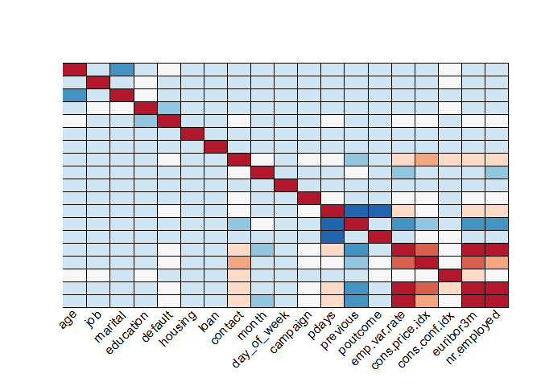
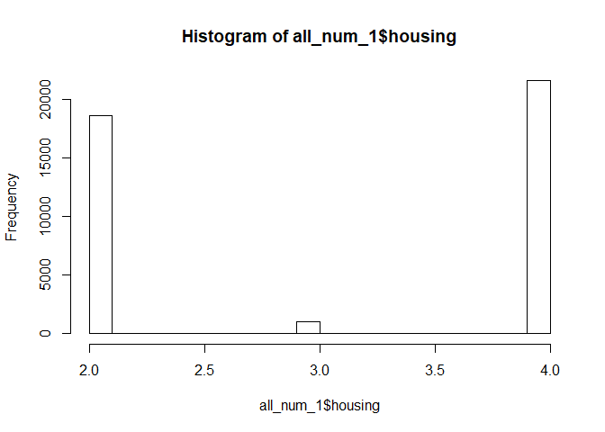

Client Term Bank Deposit Subscription Model
================
Doug MacClure
5/13/2019

## Introduction

In this report, we analyze the Bank Marketing Data Set (found here:
<https://archive.ics.uci.edu/ml/datasets/Bank+Marketing>) and construct
various classification models using 70% of the bank marketing dataset.
Various classification algorithms are discussed, and our approach using
a random forest classification model is discussed.

This project is done for the Data Science Capstone assignment via
HarvardX. The goal of this model is to create a classification model
which predicts the binary outcome of whether or not a client will
purchase a bank deposit subscription given demographic, transactional
and industry data. Here, a positive result in the model (where
\(y = 0\)) corresponds to a client **not** purchasing a subscription and
a negative result (where \(y = 1\)) corresponds to a client purchasing a
subscription. Hence, we wish to maximize both accuracy and specificity.

By specificity, we mean the proportion of clients who actually
subscribed and clients the model has predicted to subscribe. In other
words, for
\[TN = \text{ true negative, i.e., model correctly predicts client subscribed} \]

\[FP = \text{ false positive, i.e., model incorrectly predicts client didn't subscribe, when client actually subscribed} \]
then we wish to maximize \[sensitivity = \frac{TN}{TN+FP}.\] Clearly,
since, \(TN,FP \geq 0\), then \(sensitivity \in [0,1]\).

In this report, we use a random forest classification model using R 3.6
and the **randomForest** library. Random forests utilize the bagging
method together with decision trees. In other words, the training data
is subsetted in multiple ways randomly, where on each subset a decision
tree is trained. The results of these trees are combined and a value is
determined through voting. Recall, tree-based models partition the data
according to cutoff values for predictors determined by the Gini index
and entropy, which weigh the best possible proportions of these
predictors.

Tree-based models are known to capture non-linearity in the data. Since
we are attempting to model human behavior not at a macroscopic level, it
is perhaps not surpising that the data appears to have non-linear
trends.

To begin, perform the following steps: install (if necessary) and load
the required packages to run the R code: caret, tidyverse. Next,
download the required data, and wrangle/coerce data for analysis.
Finally, split the prepared data into training and validation datasets.

We begin our analysis of the data by noting which potential predictive
variables we have to work with, and how they’re correlated. First,
observe that we should not include all variables from the zip file in
the model. In particular, duration is included in the zipped .csv file.
One will soon see that it is ALWAYS important to read ALL information
given on the data before performing an analysis. The original author of
the data wrote the following:

**DEFINITION: duration-** *last contact duration, in seconds (numeric).
Important note: this attribute highly affects the output target (e.g.,
if duration=0 then y=‘no’). Yet, the duration is not known before a call
is performed. Also, after the end of the call y is obviously known.
Thus, this input should only be included for benchmark purposes and
should be discarded if the intention is to have a realistic predictive
model.*

For more information on other variables, see:
<https://archive.ics.uci.edu/ml/datasets/Bank+Marketing>

| age | marital | education | default | housing | loan | month | day\_of\_week | campaign |
| --: | ------: | --------: | ------: | ------: | ---: | ----: | ------------: | -------: |
|  56 |       3 |         1 |       2 |       2 |    2 |     7 |             3 |        1 |
|  57 |       3 |         5 |       3 |       2 |    2 |     7 |             3 |        1 |
|  37 |       3 |         5 |       2 |       4 |    2 |     7 |             3 |        1 |
|  40 |       3 |         2 |       2 |       2 |    2 |     7 |             3 |        1 |
|  56 |       3 |         5 |       2 |       2 |    4 |     7 |             3 |        1 |
|  45 |       3 |         3 |       3 |       2 |    2 |     7 |             3 |        1 |

| pdays | previous | poutcome | emp.var.rate | cons.price.idx | cons.conf.idx | euribor3m | nr.employed |
| ----: | -------: | -------: | -----------: | -------------: | ------------: | --------: | ----------: |
|   999 |        0 |        2 |          1.1 |         93.994 |        \-36.4 |     4.857 |        5191 |
|   999 |        0 |        2 |          1.1 |         93.994 |        \-36.4 |     4.857 |        5191 |
|   999 |        0 |        2 |          1.1 |         93.994 |        \-36.4 |     4.857 |        5191 |
|   999 |        0 |        2 |          1.1 |         93.994 |        \-36.4 |     4.857 |        5191 |
|   999 |        0 |        2 |          1.1 |         93.994 |        \-36.4 |     4.857 |        5191 |
|   999 |        0 |        2 |          1.1 |         93.994 |        \-36.4 |     4.857 |        5191 |

<!-- -->

We observe that three variables in particular are highly correlated to
each other, as can b. Namely, nr.employed, which indicates the number of
people employed, euribor3m, which indicates the euribor 3 month rate
(where euribor is based on the averaged interest rates at which Eurozone
banks offer to lend unsecured funds to other banks in the euro wholesale
money market), and finally the emp.var.rate, which is the employment
variation rate. Clearly, it makes sense that these three are related,
since a bank will have more employees during a good economy. However, we
will not remove two of these variables, since they capture different
information. If necessary, the author suggests to consider
regularization.

Of greatest importance in this model is that we consider the prevalence
of the target variable in the model. Observe the distribution of the
target variable. Recall that the target y, describes whether or not a
client has subscribed for a bank
deposit.

<!-- -->

We observe that 89% of the clients do not pay for a subscription. Hence,
we should be careful in how we interpret such metrics as model accuracy.
It is important to consider, since we can have a model with 100%
specificity simply by labelling all outcomes as subscriptions (i.e., y =
1). In this case, the accuracy would be around 11%. We wish to strike a
good balance between the two metrics.

Next, we wish to discern the dimensionality of the data. The author was
surprised to find out that the data is essentially 4 dimensional, since
the first 4 principal components explain over 99.9% of the variance in
the
data.

<!-- -->

To see which variables contributed the most to the variance in the data,
observe their importance towards the first four principal
components.

<!-- -->

Here, we see that housing, age, nr.employed and marital status
contribute the most to the first four principal components. Note that
highly correlated data can change the direction of the first principal
component, since it by definition points in the direction of greatest
variance. Hence, we will remove the variables nr.employed and
emp.var.rate from the model and see if the PCA is different (i.e., seems
to favor the highly correlated variables more). We indeed see a
change.

<!-- --><!-- --><!-- -->

Note now that the variables which explain the greatest variance now have
changed. In fact, it appears that the variable housing describes almost
all of the variance in the model. To see why, observe its distribution
and the even spread of the
data.

<!-- -->
However, the author has noticed a marked decline in predictive power for
all models when removing highly correlated variables. Thus, the model
should not be viewed as fundamentally one dimensional. Now, if we
consider how model variables are correlated with the first four
components prior to removing the correlated variables, some other
patterns emerge. We will soon see that several of the predictors
correlated with the first four principal components also are considered
to be predictors of high importance for our final
model.

<!-- -->

Does this imply that these correlated variables will have the greatest
importance in a model? We will see.

## Analysis

We begin our analysis by first observing that we will partition the data
as follows: 70% train, 30% test. Note, that it is extremely important
that we take prevalence into account here, since there is a roughly
89%-11% split among positive-negative results. Hence, it is extremely
important to use the createDataPartition() function from the caret
package, since prevalence is preserved.

Throughout the rest of this analysis, we will compare the accuracies and
specificities in using all of the data (sans the duration variable,
since that variable cannot be known prior to model implementation)
versus only using the model with the two aforementioned correlated
variables removed. To begin, we consider the k-nearest neighbors
algorithm using all model variables.

**WITH CORRELATED VARIABLES - REDUCED MODEL**

|  K |  Accuracy | Specificity |
| -: | --------: | ----------: |
|  1 | 0.8493849 |   0.3193033 |
|  3 | 0.8843477 |   0.2946299 |
|  5 | 0.8921172 |   0.2786647 |
|  7 | 0.8940596 |   0.2692308 |
|  9 | 0.8960829 |   0.2590711 |
| 11 | 0.8944642 |   0.2358491 |
| 13 | 0.8950308 |   0.2278665 |
| 15 | 0.8960019 |   0.2271408 |

|  K |  Accuracy | Specificity |
| -: | --------: | ----------: |
| 20 | 0.8966494 |   0.2184325 |
| 25 | 0.8974587 |   0.2111756 |
| 30 | 0.8975397 |   0.2024673 |
| 35 | 0.8978634 |   0.1937591 |
| 40 | 0.8985108 |   0.1959361 |
| 45 | 0.8982680 |   0.1901306 |
| 50 | 0.8985108 |   0.1915820 |

**WITHOUT CORRELATED VARIABLES - FULL MODEL**

|  K |  Accuracy | Specificity |
| -: | --------: | ----------: |
|  1 | 0.8514082 |   0.3185776 |
|  3 | 0.8840240 |   0.2743106 |
|  5 | 0.8923600 |   0.2656023 |
|  7 | 0.8935740 |   0.2496372 |
|  9 | 0.8934930 |   0.2329463 |
| 11 | 0.8938977 |   0.2242380 |
| 13 | 0.8934121 |   0.2140784 |
| 15 | 0.8935740 |   0.2075472 |

|  K |  Accuracy | Specificity |
| -: | --------: | ----------: |
| 20 | 0.8948689 |   0.2017417 |
| 25 | 0.8966494 |   0.2010160 |
| 30 | 0.8964875 |   0.1959361 |
| 35 | 0.8967303 |   0.1930334 |
| 40 | 0.8964066 |   0.1915820 |
| 45 | 0.8964875 |   0.1901306 |
| 50 | 0.8962447 |   0.1937591 |

Clearly, we see a small improvement in specificity when using the
reduced model. However, are we able to improve this result? We will see
that indeed we can.

| model   |  accuracy | specificity |
| :------ | --------: | ----------: |
| Full    | 0.8340078 |    0.469521 |
| Reduced | 0.8343315 |    0.371553 |

Perhaps surprisingly, we see a marked decline in specificity from 47% to
37% when we use the reduced model instead of the full model. In fact,
the author has tried many different models using default parameters,
where none were able to capture a specificity beyond 30%. Hence, as of
this moment, we have a potential candidate model: using the Naive Bayes
method with all the data sans duration.

However, the randomForest algorithm has given the best predictive power
on the training set. The author has also noticed a decline in
Specificity when using the Reduced Model. Thus, we use the Full Model
moving forward.

## Results

    ## Confusion Matrix and Statistics
    ## 
    ##           Reference
    ## Prediction     0     1
    ##          0 10975   247
    ##          1     3  1131
    ##                                           
    ##                Accuracy : 0.9798          
    ##                  95% CI : (0.9771, 0.9822)
    ##     No Information Rate : 0.8885          
    ##     P-Value [Acc > NIR] : < 2.2e-16       
    ##                                           
    ##                   Kappa : 0.8893          
    ##                                           
    ##  Mcnemar's Test P-Value : < 2.2e-16       
    ##                                           
    ##             Sensitivity : 0.9997          
    ##             Specificity : 0.8208          
    ##          Pos Pred Value : 0.9780          
    ##          Neg Pred Value : 0.9974          
    ##              Prevalence : 0.8885          
    ##          Detection Rate : 0.8882          
    ##    Detection Prevalence : 0.9082          
    ##       Balanced Accuracy : 0.9102          
    ##                                           
    ##        'Positive' Class : 0               
    ## 

We note the comparitively remarkable results of **82% specificity**, and
**98% accuracy** in using the **randomForest** model with five variables
tried at each split. Next, consider the variable importance for this
model.

|                |         0 |           1 | MeanDecreaseAccuracy | MeanDecreaseGini |
| -------------- | --------: | ----------: | -------------------: | ---------------: |
| age            | 21.822285 |  11.1594118 |            25.229553 |        350.87394 |
| job            | 19.389799 |   2.3708744 |            18.818199 |        179.62713 |
| marital        | 11.954319 |   5.3282238 |            13.714666 |         86.94913 |
| education      | 16.208308 |   1.9877826 |            16.423183 |        157.25276 |
| default        |  4.276332 |   6.9282759 |             7.484450 |         31.38169 |
| housing        |  4.614186 |   2.9257368 |             5.660135 |         73.63008 |
| loan           |  4.201911 |   2.5691273 |             4.813084 |         53.83768 |
| contact        | 10.834119 |  18.4609052 |            13.854503 |         32.99849 |
| month          | 25.454616 | \-5.7291976 |            25.765855 |         50.52718 |
| day\_of\_week  | 24.150336 | \-0.6575341 |            23.780736 |        136.97701 |
| campaign       |  4.833048 |   5.6099761 |             6.932737 |        149.68246 |
| pdays          |  2.334669 |  30.6125346 |            23.231044 |         90.00175 |
| previous       |  7.459433 | \-4.1118639 |             6.467793 |         40.17871 |
| poutcome       |  6.668723 |  23.0109077 |            19.378662 |         82.41113 |
| emp.var.rate   | 14.883092 |   4.9457835 |            15.571174 |         43.63771 |
| cons.price.idx | 17.798173 | \-6.6885761 |            18.008336 |         57.78303 |
| cons.conf.idx  | 19.530145 | \-3.1251376 |            19.949520 |         66.58978 |
| euribor3m      | 31.219622 |   0.5339358 |            33.883494 |        324.14493 |
| nr.employed    | 18.308641 |  20.5186768 |            21.821478 |        171.79840 |

The top 5 most important variables for this model are **euribor3m,
month, age, day\_of\_week** and **pdays**. Note how some of these
variables are correlated with some of the first four principal
components. Recall that a predictor is deemed important if permuting its
values increases the model error. Hence, a high mean decrease accuracy
indicates a predictor which has a large impact on the model. It is also
important to note that despite the fact that the PCA seems to suggest
that the predictor dataset is essentially four-dimensional from a
variance perspective, yet there are no predictors whose mean decrease
accuracy vanishes. Hence, one should be careful when reducing the
dimension of the dataset using PCA.

Finally, note that we can reduce the complexity of our final model by
reducing the number of trees from 500 to 100, as indicated in the
following error plot (Note, that the error value for \(1\) converges to
\(0.7\)
.

<!-- -->

## Conclusion

We have arrived at an acceptable model: using the **randomForest()**
function with *mtry = 5*. We achieve an **82% specificity** using this
model together with a **98% accuracy** when evaluating the model on the
test set.

Hence, we advise the bank to use the model to target their marketing
efforts towards clients who the model deem to be likely to purchase a
subscription. In using this model, it is likely that the bank can expect
to cut mailing/advertising costs by 89% (due to prevalence) while still
retaining 82% of the total revenue they would have obtained if they
targeted the entire population.

To further improve this model, the author suggests to further change
hyperparameters in the randomForest() algorithm. Another way in which
this model could be improved is if we also considered neural networks
and/or using an ensemble model approach.
